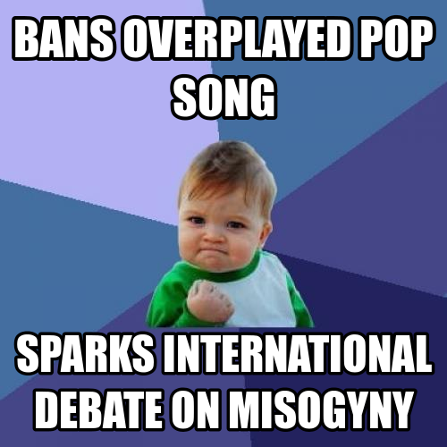

I've been surprised by the amount of backlash against [Robin Thicke's track with the rapey lyrics](http://www.lyrics.com/blurred-lines-lyrics-robin-thicke.html) being banned across more and more UK campuses. Our [student union](http://www.eusa.ed.ac.uk/) here at the University of Edinburgh was, I believe, the first to ban "Blurred Lines" due to a combination of:

1. EUSA's zero-tolerance [sexual harassment campaign/policy](http://www.eusa.ed.ac.uk/societies/run/training/zerotolerancecampaign/), and
2. Our Freshers Week being earlier than most (16th September onwards).

Upon returning for Freshers, a fair few of my student chums expressed outrage at EUSA seeming to act out yet again, and this time against one of summer's [most popular singles](http://www.billboard.com/articles/news/5687036/robin-thickes-blurred-lines-is-billboards-song-of-the-summer).

But first, a bit of background: although I'm not familiar with any other student unions, EUSA is often regarded by UoE students as having a rather heavy hand. Last year, for example, we had [a large brouhaha](http://www.theguardian.com/media/2013/feb/11/student-newspaper-gagged-edinburgh-university) when [they gagged The Student with an injunction](http://www.studentnewspaper.org/tag/injunction/), supposedly over protecting an employee's privacy, but at first glance because of internal politics. Personally, I'm *still* unsure what occurred, and I don't really care enough to find out what it was all about.

I'm not surprised that many see EUSA's "Blurred Lines" ban as further proof of a willingness to use censorship as a first resort against, well... everything. But, as much distaste as I have for student politics, I don't support this hypothesis.

## What Did EUSA Actually Do?

Did EUSA overexert their powers in this situation? I would say not.

- They banned a single song from playing in venues which they operate,
- In doing so, they increased awareness of misogyny in popular music,
- The track was on it's way out anyway,
- If you still want to hear it you can go *anywhere* else in Edinburgh.

Talk about a proportional and effective response! At the very least they deserve an internet meme for all that:

At the end of the day, what did EUSA actually do?

They did not 'ban' or 'censor' the track on campus, in any literal or meaningful sense; EUSA operates (owns?) the venues where the track is no longer allowed to be played. Without stepping on anybody's rights, it is perfectly entitled to choose it's songs or [refuse to sell products][page 3 ban] as it sees fit[^1].

And yes, if EUSA did follow it's zero-tolerance policy to it's logical conclusion then they'd have to stop playing a whole bunch of other songs, too. But banning songs isn't the point! I don't believe that (all) the folks at EUSA want to play moral arbiter and make people suffer by dictating what they can/can't listen to. They could have done that much more effectively by following their principle to the letter,  actually banning a significant portion of modern recordings, and making their venues irrelevant in the process. But they're no Chairman Mao. This wasn't meant to be cultural revolution, it was *targeted assassination*.

**EUSA have banned a popular (but fading) track so that we have this debate in the first place.** After all, if you still want to hear Blurred Lines in a club, there are plenty of venues in Edinburgh which will happily play radio-music for you every night of the week[^2].

The University of Edinburgh has apparently been subject to ["public humiliation"](http://tychy.wordpress.com/2013/09/15/another-eusa-censorship-disaster/) in the [national](http://www.bbc.co.uk/newsbeat/24071219) (and now [international](https://news.google.com/news?ned=us&q=blurred%20lines%20eusa%20ban&btnG=Search+News)) press because of EUSA taking this stand, 'over a song', but hey, you're the ones wailing about it. And all this debate still sounds better than hearing *that damn song again*...

[page 3 ban]: http://www.journal-online.co.uk/article/9288-eusa-referendum-debate-sparks-indepth-discussion "There was an attempt to ban The Sun newspaper in EUSA shops last October, but I'm not sure whether it was successful or not."

[^1]: UPDATE: To clarify further, there are two reasons why this is not censorship:
1. As an entity, EUSA is entitled to play whatever it likes on it's own damn property, much in the same way I am. If I were in charge of club playlists, I'd have a *much* longer list of "no-play" songs. However, my refusal to blare [Rebecca Black's 'Friday'](https://www.youtube.com/watch?v=kfVsfOSbJY0) on my laptop or theoretical club soundsystem does not constitute censorship of this track either. The difference is that in most venues you can only vote with your feet/wallets, but since EUSA is a democratic organization, [you have representatives](http://www.eusa.ed.ac.uk/getinvolved/elections/yourrepresentatives/find/) to complain at, if you want a policy changed!
2. Again, this isn't really a "campus-wide ban". EUSA does not want EUSA employees to play the track in question on EUSA property. You can still blare "Blurred Lines" on your phone in Bristo Square, or listen to it on your headphones in the library if you like. EUSA have no power to impose any sort of restriction on your poor taste. :-)

[^2]: I personally found the DJ at [Castle Clvb](http://www.theskinny.co.uk/venue/9432-castle_club) last Saturday night to be extremely entertaining. Not only did he have a library consisting entirely of circa 2007 rap music (i.e. 50 Cent and Eminem) but he also had this ability, nay *need*, to change tracks every 90 seconds on the dot! 2.5/5, funniest DJ set ever.
